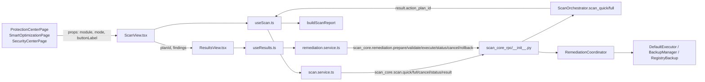

# SC-8C8 Scan + Remediation Final Integration Security & UX Audit

**Scope:** `apps/pc-optimizer/src/features/scan/*` and the related backend `scan_core` RPC / orchestration surface.
**Date:** 2026-08-15
**Auditor:** Subagent read-only review
**Repo:** `C:\Users\HPBP\Documents\GitHub\avs-suite`

---

## 1. Executive Summary

The SC-8C8 implementation satisfies the core safety architecture: the frontend is read-only, all destructive operations are brokered through the `scan_core.remediation.*` JSON-RPC endpoints, plan IDs are backend-generated, approval is explicit, double-execution/rollback are guarded by refs, and the legacy `orchestrator.optimize` / `orchestrator.fullAsync` / `security.remediation` paths are not reached from the new scan feature.

All 59 unit tests in `apps/pc-optimizer/src/features/scan/__tests__/` pass.

**Overall Verdict: CONDITIONAL PASS for SC-8C9 start**, with one HIGH-severity UX/contract gap that should be fixed before production (stale-plan rejection does not surface cleanly to the UI and can cause an infinite-polling "executing" state).

**Counts:**

| Class | Count |
|-------|-------|
| CRITICAL RISK | 0 |
| HIGH | 1 |
| MEDIUM | 2 |
| LOW | 1 |
| PASS | 38 |

---

## 2. Architecture / Data Flow



**Key architectural invariants verified:**

- The three module pages import a single shared `ScanView` from `features/scan`.
- `ResultsView` is the only consumer of `useResults`, which is the only caller of `remediation.service.execute`.
- `remediation.service.execute` is the only frontend `scan_core.remediation.execute` RPC call.
- No frontend scan code directly touches `fs`, `child_process`, `PowerShell`, `reg.exe`, `localStorage`, or `sessionStorage`.

---

## 3. Security Invariant Matrix

| # | Invariant | Status | File/Line | Notes |
|---|-----------|--------|-----------|-------|
| 1 | Scans are read-only on the frontend | PASS | `scan.service.ts:35-42`, `useScan.ts:215-234` | No destructive calls in scan lifecycle. |
| 2 | `scan_core.scan.*` is the only scan RPC surface used | PASS | `scan.service.ts:36-41`, `useScan.ts:220` | Legacy orchestrator methods not imported or called. |
| 3 | Plan ID is never fabricated in frontend | PASS | `reportBuilder.ts:112`, `ScanView.tsx:78` | `planId` is `result.action_plan_id` from backend. |
| 4 | `scan_core.remediation.execute` is only called after explicit approval | PASS | `useResults.ts:186-204`, `ValidationPanel.tsx:119-127` | `approve()` requires `validation.valid === true` and `preview !== null`. |
| 5 | `scan_core.remediation.execute` is the only `execute` RPC source | PASS | `remediation.service.ts:43-49`, `grep 'execute'` | Only `remediation.service.ts` and tests contain `SCAN_CORE_REMEDIATION_EXECUTE`. |
| 6 | No direct filesystem / registry / process / PowerShell in the scan feature | PASS | `grep` for `fs\|child_process\|PowerShell\|reg\.exe\|localStorage\|sessionStorage\|BackupManager\|RegistryBackup\|SafetyGate` | No matches in production scan source; only in tests and backend executor. |
| 7 | Double-approval is prevented | PASS | `useResults.ts:87-88`, `186-195` | `hasRequestedExecution` ref blocks subsequent calls. |
| 8 | Double-rollback is prevented | PASS | `useResults.ts:89`, `256-263` | `hasRequestedRollback` ref blocks duplicate confirms. |
| 9 | Rollback requires explicit confirmation | PASS | `TerminalStatePanel.tsx:87-91`, `RollbackConfirmationPanel.tsx:74-76` | Two-step UI before RPC. |
| 10 | Rollback uses the same `execution_id` from execute | PASS | `useResults.ts:199`, `267` | `executionId` is `summary.execution_id`; `rollback` is called with it. |
| 11 | Legacy `orchestrator.optimize` / `orchestrator.fullAsync` not reachable from new scan flow | PASS | `orchestrator.service.ts:209-218` (defined but unused), tests | No production import/call in `features/scan`. |
| 12 | Legacy `security.remediation` not reachable | PASS | `grep` in `features/scan` | Only referenced in `rollback.test.tsx` to assert it is not called. |
| 13 | `window.avs.rpc.call` is abstracted behind services | PASS | `scan.service.ts:9-14`, `remediation.service.ts:17-22` | No component calls `window.avs.rpc.call` directly. |
| 14 | Cancel is passed through to backend | PASS | `useScan.ts:236-241`, `useResults.ts:223-231` | `scan_core.scan.cancel` and `scan_core.remediation.cancel` used. |
| 15 | Status polling derives from backend, not a local timer | PASS | `useScan.ts:205-211`, `useResults.ts:331-334` | 500 ms polls read real backend state. |
| 16 | `mode: 'live'` is explicitly passed by frontend | PASS | `useResults.ts:203`, `remediation.service.ts:43` | Backend default is `dry_run`; frontend forces `live` only at approval. |
| 17 | Rollback conflicts/duplicates are handled | PARTIAL | `useResults.ts:268-273` | `ok: false` falls to error/unavailable; no explicit UI for "already in progress". |
| 18 | Stale or invalid plan rejection is surfaced cleanly | FAIL | `remediation.py:113-119`, `useResults.ts:211-214`, `ValidationPanel.tsx:20` | Backend returns `ok: true, status: 'rejected'` for stale/missing-token plans; frontend does not recognize `'rejected'` as terminal or non-executable and falls into an executing/unknown polling loop. See Finding H-1. |

---

## 4. Frontend / Backend Contract Matrix

| Frontend Call | RPC Method | Params | Calls From | Backend Handler | Match |
|---------------|------------|--------|------------|-----------------|-------|
| `scanService.scan_quick(scope?)` | `scan_core.scan.quick` | `{ scope }` | `useScan.ts:220` | `__init__.py:414-417` | YES |
| `scanService.scan_full(scope?)` | `scan_core.scan.full` | `{ scope }` | `useScan.ts:220` | `__init__.py:420-423` | YES |
| `scanService.cancel_scan(sid)` | `scan_core.scan.cancel` | `{ session_id }` | `useScan.ts:239`, `109-110` | `__init__.py:426-443` | YES |
| `scanService.status(sid)` | `scan_core.scan.status` | `{ session_id }` | `useScan.ts:195` | `__init__.py:446-465` | YES |
| `scanService.result(sid)` | `scan_core.scan.result` | `{ session_id }` | `useScan.ts:123` | `__init__.py:468-487` | YES |
| `remediationService.prepare(planId)` | `scan_core.remediation.prepare` | `{ plan_id }` | `useResults.ts:153` | `__init__.py:184-200` | YES |
| `remediationService.validate(planId)` | `scan_core.remediation.validate` | `{ plan_id }` | `useResults.ts:174` | `__init__.py:203-219` | YES |
| `remediationService.execute(...)` | `scan_core.remediation.execute` | `{ plan_id, request_id, approval_token, mode }` | `useResults.ts:199` | `__init__.py:222-251` | YES |
| `remediationService.status(execId)` | `scan_core.remediation.status` | `{ execution_id }` | `useResults.ts:307` | `__init__.py:273-289` | YES |
| `remediationService.cancel(execId)` | `scan_core.remediation.cancel` | `{ execution_id }` | `useResults.ts:227` | `__init__.py:254-270` | YES |
| `remediationService.rollback(execId)` | `scan_core.remediation.rollback` | `{ execution_id }` | `useResults.ts:267` | `__init__.py:292-308` | YES |

**Notes:**

- Backend parameter validation in `__init__.py:130-135` enforces `plan_id`, `request_id`, `approval_token` as strings for execute and `mode in ('dry_run', 'live')`.
- Backend `scan_core.scan.cancel` returns `cancelled` even if orchestrator is unavailable, which is a safe fallback.

---

## 5. Plan Identity

| Aspect | Status | Details |
|--------|--------|---------|
| Origin | PASS | `action_plan_id` is generated by `ScanOrchestrator._build_result` at `orchestrator.py:470-501` and stored in `ScanResult.action_plan_id`. |
| No fabrication | PASS | `reportBuilder.ts:112` reads `result.action_plan_id`; `ScanView.tsx:78` uses `scan.report?.planId ?? scan.result?.action_plan_id`. |
| Stale handling | PARTIAL | `PreviewPanel.tsx:54-58` renders a stale warning, but `ValidationPanel.tsx:20` and `useResults.ts:186-194` do not block `Approve & Fix` for `preview.is_stale`. Backend `RemediationCoordinator.execute` rejects stale plans (`remediation.py:113-115`), but the response shape causes a UX failure (see H-1). |
| Action ID authority | PASS | `request_id` and `approval_token` are generated server-side in `RemediationCoordinator.prepare` (`remediation.py:84-85`) and consumed by `execute` without frontend mutation. |

---

## 6. Approval

| Aspect | Status | File/Line | Notes |
|--------|--------|-----------|-------|
| Approval token generated server-side | PASS | `remediation.py:84-85` | `approval_token = uuid.uuid4()`. |
| Token validated on execute | PASS | `__init__.py:225-228`, `remediation.py:118-121` | Empty token with `mode == 'live'` is rejected. |
| Validation gating | PASS | `useResults.ts:190-194` | `approve()` requires `validation.valid === true`. |
| Explicit approval UI | PASS | `ValidationPanel.tsx:119-127` | `Approve & Fix` is only shown when `validation.valid` and `canApprove` true. |
| Double-click protection | PASS | `useResults.ts:87-88`, `186-195` | `hasRequestedExecution` ref. |
| Stale validation | FAIL | `ValidationPanel.tsx:20`, `useResults.ts:186-194` | `Approve & Fix` does not re-check `preview.is_stale`; stale plans are sent to execute and rejected. |
| UI-state trust | PARTIAL | `useResults.ts:211-214` | Frontend trusts `response.ok` and a summary with `status: 'rejected'` as sufficient to enter `executing`; no validation that `status` is a recognized `ExecutionStatus`. |

---

## 7. Execution

| Aspect | Status | File/Line | Notes |
|--------|--------|-----------|-------|
| Execute triggered only by approval | PASS | `useResults.ts:186-204` | `approve()` is the only `remediationService.execute` caller. |
| `mode` is explicitly `live` | PASS | `useResults.ts:203` | Backend default is `dry_run`; frontend forces `live`. |
| Status polling | PASS | `useResults.ts:295-342` | Polls `scan_core.remediation.status` every 500 ms while `step === 'executing'`. |
| Cancel | PASS | `useResults.ts:223-231`, `ExecutionProgressPanel.tsx:112-123` | Calls `scan_core.remediation.cancel`; button hidden when terminal. |
| Terminal states | PARTIAL | `useResults.ts:38-43` | Recognizes `completed`, `partial`, `failed`, `cancelled`. Does **not** recognize backend `rejected` status, causing an infinite-poll UX. |
| RPC failures | PASS | `useResults.ts:295-328` | Polling errors clear the timer and set `step = 'error'`. Execute errors set `error` and `hasRequestedExecution.current = false`. |
| No frontend timer assumptions | PASS | `useScan.ts:208-211`, `useResults.ts:332-334` | Timers only schedule RPC polls; progress is backend-provided. |

---

## 8. Rollback

| Aspect | Status | File/Line | Notes |
|--------|--------|-----------|-------|
| Availability gating | PASS | `useResults.ts:233-238` | `rollbackAvailable()` checks terminal status, `completed > 0`, and `preview.rollback_supported`. |
| Confirmation step | PASS | `TerminalStatePanel.tsx:87-91`, `RollbackConfirmationPanel.tsx:74-76` | Two-click workflow. |
| Correct `execution_id` | PASS | `useResults.ts:267` | Uses the `executionId` from the execute response. |
| Double-rollback prevention | PASS | `useResults.ts:89`, `256-263` | `hasRequestedRollback` ref stays true. |
| Conflict handling | PASS | `useResults.ts:268-273` | `ok: false` maps to `failed` or `unavailable` state. |
| No direct system access | PASS | `RollbackResultPanel.tsx` only renders backend summary. | Restoration is performed by backend `BackupManager`/`RegistryBackup`. |
| Poll/rollback concurrency | PASS | `useResults.ts:241-248` | `initiateRollback` blocked unless execution is terminal. |

---

## 9. Three-Module Consistency

All three module pages import `ScanView` from the same barrel export (`features/scan/index.ts:19`).

| Page | Module | Mode | `ScanView` usage | Line |
|------|--------|------|------------------|------|
| `ProtectionCenterPage.tsx` | `protection` | `full` | `<ScanView module="protection" ... />` | 130-136 |
| `SmartOptimizationPage.tsx` | `optimize` | `quick` | `<ScanView module="optimize" ... />` | 248-254 |
| `SecurityCenterPage.tsx` | `security` | `full` | `<ScanView module="security" ... />` | 228-234 |

All pages set `onClose={() => {}}` (a no-op), which is a UX note but not a security issue.

---

## 10. Smart Optimization Safety

The `ScanView` used by the AI Smart Optimize page is safe: it requires an explicit start click, runs a scan, and only shows `Review & Remediate` when a plan exists. It never auto-runs `scan_core.remediation.execute`.

However, **the `SmartOptimizationPage.tsx` contains a separate optimization engine (`SmartOptimizationEngine`) that is outside the SC-8C8 `ScanView` flow.**

- `Auto Optimize` button directly calls `vm.executePlan()` (`SmartOptimizationPage.tsx:217-223`, `360-365`).
- There is a `Background Optimization` toggle bound to `autoApproveLowRisk` (`SmartOptimizationPage.tsx:417-421`).
- This engine was not opened or audited for this report.

**Status for `ScanView` flow:** PASS
**Status for the rest of the Smart Optimization page:** NOT VERIFIED (separate scope)

---

## 11. Legacy Paths

| Legacy method | Location | Reachability from `features/scan` |
|---------------|----------|-----------------------------------|
| `orchestrator.optimize` | `orchestrator.service.ts:212` | **Not reached.** Tests `scan.test.tsx:373` and `rollback.test.tsx:431` assert it is not called. No production import in `features/scan`. |
| `orchestrator.fullAsync` | `orchestrator.service.ts:216` | **Not reached** from `features/scan`. The class still exists and is imported/spied in tests only. `DashboardViewModel.ts:1463` still references it for other flows (not audited). |
| `security.remediation.rollback` | `RPC_METHODS.SECURITY_REMEDIATION_ROLLBACK` | **Not reached.** `rollback.test.tsx:438` asserts it is never called. |

---

## 12. Privacy

- `ScanContext` stores privacy-safe `machine_id_hash` and `user_id_hash` (`orchestrator.py:230-238`); these are not exposed to the UI.
- `FindingsList.tsx:113-117` displays `canonical_path` in the UI, which is expected for a file-cleaner product but could expose user paths in screenshots.
- No PII fields were seen in the `ScanFinding` type (`types.ts:8-23`).
- No `localStorage`/`sessionStorage` usage in the scan feature.

---

## 13. Persistence / Recovery

| What | Survives reload? | Recovery RPC? | Notes |
|------|------------------|---------------|-------|
| Scan session ID | NO | NO | `_scan_sessions` is in-memory in `scan_core_rpc/__init__.py:46`. |
| Scan result / plan | YES (metadata DB) | Partial | `ActionPlan` is persisted in DB via `_action_plan_repo.save` (`orchestrator.py:150-151`). A fresh scan must be started to get a new `session_id`. |
| Execution status | YES | `scan_core.remediation.status` | Stored in `ExecutionRepository` (`remediation.py:151-158`). |
| Rollback | YES | `scan_core.remediation.rollback` | Rollback can be requested as long as `execution_id` is known and backups/records exist. |
| Frontend `useScan` / `useResults` state | NO | NO | No local storage; reloading the page resets the UI. |

---

## 14. Performance

- Polling is hardcoded at 500 ms in both `useScan.ts:208` and `useResults.ts:332`. This is acceptable for short scans but not adaptive.
- `FindingsList.tsx:35` caps the list at `max-h-[420px] overflow-y-auto`; no virtualized rendering for very large plans.
- `affected_targets` in `PreviewPanel.tsx:93-103` renders up to the full list without virtualization; `RollbackConfirmationPanel.tsx:49-57` truncates display to 10 but the data object may be larger.
- No frontend timer assumptions on completion time; the UI waits for `completed` / terminal flags from backend.

**Finding:** MEDIUM (M-1) — fixed 500 ms polling with no backoff for terminal states.

---

## 15. Test Coverage Matrix

| Area | File | Tests | Status |
|------|------|-------|--------|
| Scan lifecycle / three modules | `__tests__/scan.test.tsx` | 18 | PASS |
| Results / preview / validation / approval / execution | `__tests__/results.test.tsx` | 22 | PASS |
| Rollback / double-rollback / conflicts | `__tests__/rollback.test.tsx` | 20 | PASS |
| **Total** | | **59** | **59/59 PASS** |

Notable test cases:

- `scan.test.tsx:470` — full flow reaches approval and only calls `scan_core.remediation.execute` after explicit `Approve & Fix`.
- `scan.test.tsx:373` — `orchestrator.fullAsync` / `orchestrator.optimize` never called.
- `results.test.tsx:852` — `Approve & Fix` double-click is prevented.
- `results.test.tsx:903` — disallowed methods never called.
- `rollback.test.tsx:220` — rollback requires explicit confirmation and calls `scan_core.remediation.rollback` exactly once.
- `rollback.test.tsx:408` — no direct filesystem / registry / browser APIs invoked.
- `rollback.test.tsx:438` — `security.remediation.rollback` never called.

---

## 16. UX / State Consistency

| State / message | Observation | Severity |
|-----------------|-------------|----------|
| `rejected` execution status not in `ExecutionStatus` union | `types.ts:79-88` omits `'rejected'`, but backend can return it. `useResults.ts:211-214` enters `executing` step and polls `execution_id` that has no persisted status. | HIGH |
| Stale preview warning not gated at approval | `PreviewPanel.tsx:54-58` warns but `ValidationPanel.tsx:20` does not use `preview.is_stale`. | HIGH |
| `sessionId` returned from `useScan` is a ref | `useScan.ts:93`, `253` — not a state; may be momentarily stale but is not consumed by `ScanView`. | LOW |
| `onClose` is `() => {}` in all three module pages | No-op close handler. Not a security bug, but inconsistent with expected modal/overlay behavior. | LOW |
| "No issues found" vs "Review & Remediate" gating | `ScanView.tsx:31-34` only shows `Review & Remediate` when `planId` and `issuesFound > 0`. | PASS |

---

## 17. Critical / High / Medium / Low Findings

### H-1: Stale plan / missing approval token leads to an infinite "executing" polling loop

- **Files:** `backend/src/avs_backend/scan_core/orchestration/remediation.py:113-121`, `apps/pc-optimizer/src/features/scan/useResults.ts:211-214`, `apps/pc-optimizer/src/features/scan/types.ts:79-88`, `apps/pc-optimizer/src/features/scan/ValidationPanel.tsx:20`.
- **Class:** HIGH
- **Description:** `RemediationCoordinator.execute` returns `ok: true` with a `summary` whose `status` is `'rejected'` when the plan is stale or `approval_token` is missing. The frontend does not include `'rejected'` in `ExecutionStatus`, and `isTerminalStatus()` in `useResults.ts:40-43` does not recognize it. The UI therefore transitions to `step === 'executing'` and begins polling `scan_core.remediation.status` for an `execution_id` that was never persisted, leading to `status: 'unknown'` and an indefinite poll loop. The user sees an in-progress panel for a plan that was never executed.
- **Recommendation:** Either (a) have the backend return `ok: false` for rejected/stale executions, or (b) expand the frontend `ExecutionStatus` and `isTerminalStatus` handling to treat `'rejected'` as a terminal/failed state. Also gate `Approve & Fix` on `!preview.is_stale`.

### M-1: Fixed 500 ms polling with no backoff

- **Files:** `useScan.ts:208`, `useResults.ts:332`.
- **Class:** MEDIUM
- **Description:** Both scan and execution polling use a fixed 500 ms interval and never increase/decrease based on state, completion proximity, or network conditions. For long-running remediations with many actions, this can generate excessive RPC traffic.
- **Recommendation:** Add a backoff / adaptive poll (e.g., 1 s after inactivity, 5 s when progress is slow, or stop polling immediately on terminal state).

### M-2: `SmartOptimizationPage` auto-execute path is outside the audited SC-8C8 flow

- **Files:** `SmartOptimizationPage.tsx:217-223`, `360-365`, `417-421`.
- **Class:** MEDIUM
- **Description:** The `ScanView` on this page is safe, but the same page contains an unrelated `SmartOptimizationEngine` with an `Auto Optimize` button and `autoApproveLowRisk` toggle. Its execution handler was not opened in this audit, so the "explicit approval" invariant has not been verified for that path.
- **Recommendation:** Audit `smart-optimization-ai/executionHandler.ts` before shipping auto-optimization features.

### L-1: `scanService.scan` is an unused duplicate of `scanService.scan_quick`

- **Files:** `scan.service.ts:36-37`, `useScan.ts:220`.
- **Class:** LOW
- **Description:** The `scan` method on `ScanService` and `scan_quick` both call `scan_core.scan.quick`. `useScan.ts` calls `scan_quick`/`scan_full` directly, so `scan` is never used. This is dead/confusing code, not a security risk.
- **Recommendation:** Remove `scan` or alias it to the correct method, or document that `scan` is the legacy alias.

---

## 18. Production Readiness Verdict

The SC-8C8 scan + remediation implementation is **structurally sound and safe**: scans are read-only, remediation is brokered through a small set of `scan_core.remediation.*` RPC methods, plan IDs are backend-generated, explicit approval is required, and rollback is gated and confirmed. All 59 unit tests pass.

**Blocking issue for production:** The stale-plan / rejected-execution handling described in **H-1** can leave the user stuck in a phantom "executing" state. This should be resolved before the feature is considered production-ready.

**Can SC-8C9 begin?** 

**Yes, with the condition that H-1 is fixed as the first SC-8C9 item.** The remainder of the surface (legacy isolation, explicit approval, rollback safety, and test coverage) is in good shape.

---

## Appendix A. Files Opened / Read

- `apps/pc-optimizer/src/features/scan/scan.service.ts`
- `apps/pc-optimizer/src/features/scan/useScan.ts`
- `apps/pc-optimizer/src/features/scan/ScanView.tsx`
- `apps/pc-optimizer/src/features/scan/ResultsView.tsx`
- `apps/pc-optimizer/src/features/scan/useResults.ts`
- `apps/pc-optimizer/src/features/scan/remediation.service.ts`
- `apps/pc-optimizer/src/features/scan/types.ts`
- `apps/pc-optimizer/src/features/scan/FindingsList.tsx`
- `apps/pc-optimizer/src/features/scan/PreviewPanel.tsx`
- `apps/pc-optimizer/src/features/scan/ValidationPanel.tsx`
- `apps/pc-optimizer/src/features/scan/ExecutionProgressPanel.tsx`
- `apps/pc-optimizer/src/features/scan/TerminalStatePanel.tsx`
- `apps/pc-optimizer/src/features/scan/RollbackConfirmationPanel.tsx`
- `apps/pc-optimizer/src/features/scan/RollbackResultPanel.tsx`
- `apps/pc-optimizer/src/features/scan/reportBuilder.ts`
- `apps/pc-optimizer/src/features/scan/__tests__/scan.test.tsx`
- `apps/pc-optimizer/src/features/scan/__tests__/results.test.tsx` (test names/structure)
- `apps/pc-optimizer/src/features/scan/__tests__/rollback.test.tsx` (test names/structure)
- `packages/shared/src/rpc/index.ts`
- `backend/src/avs_backend/scan_core_rpc/__init__.py`
- `backend/src/avs_backend/scan_core/orchestration/orchestrator.py`
- `backend/src/avs_backend/scan_core/orchestration/remediation.py`
- `backend/src/avs_backend/scan_core/orchestration/remediation_models.py`
- `apps/pc-optimizer/src/features/protection-center/components/ProtectionCenterPage.tsx`
- `apps/pc-optimizer/src/features/smart-optimization-ai/SmartOptimizationPage.tsx`
- `apps/pc-optimizer/src/features/security-dashboard/SecurityCenterPage.tsx`
- `apps/pc-optimizer/src/features/orchestrator/orchestrator.service.ts`
- `apps/pc-optimizer/src/features/scan/index.ts`
- `apps/pc-optimizer/src/features/scan/moduleConfigs.ts`

## Appendix B. Commands Run

```powershell
npx vitest run apps/pc-optimizer/src/features/scan/__tests__/ --reporter=verbose
```

Result: **3 test files passed, 59/59 tests passed**, with `act(...)` warnings in two `rollback.test.tsx` cases that did not fail.