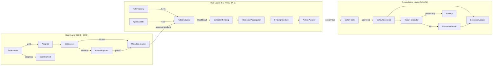

# SC-8C4 Final Integration & Security Audit

## Executive Summary

This is a **read-only architectural and integration audit** of AVS SHIELD
components SC-1 through SC-8C4. No production code was modified.

**Overall conclusion:** The core remediation engine (SC-8C4) is **architecturally
sound** and the frozen executors (filesystem, registry, browser, startup) are
connected and pass the full test suite. However, **several integration and
safety gaps remain between the scan layer (SC-1) and the remediation layer
(SC-8C4)**. The most serious are:

1. **No post-execution verification** — executors report `COMPLETED` without
   independently re-checking the target.
2. **Default-execution-context fallback** — `DefaultExecutor` can run with
   stale or fabricated live state.
3. **Incomplete action mapping** — many asset categories discovered by the
   scan layer have no executable remediation action.
4. **No `ActionPlan` persistence** — plans exist only in memory.
5. **Packaging bug** — `StartupExecutor` is listed in `__all__` but not
   imported at package top-level.

## Scope

Audited, in read-only mode:

- `src/avs_backend/scan_core/enumerators`
- `src/avs_backend/scan_core/adapters`
- `src/avs_backend/scan_core/assets`
- `src/avs_backend/scan_core/context`
- `src/avs_backend/scan_core/metadata`
- `src/avs_backend/scan_core/rules`
- `src/avs_backend/scan_core/execution`
- `tests/test_sc8c4_part*.py`

## Validation Results

| Check | Scope | Result |
|-------|-------|--------|
| `python -m pytest -q` | Full suite | **1070 passed, 14 skipped, 0 failed** |
| `mypy src/avs_backend/scan_core/execution` | SC-8C4 execution engine | **0 issues** |
| `mypy src/avs_backend/scan_core` | Full scan/rules/execution | **33 errors in 6 files** |
| `flake8 --max-line-length=100 src/avs_backend/scan_core/execution tests/test_sc8c4_part5_startup.py` | New/frozen execution scope | **clean** |
| `flake8 --max-line-length=100 src/avs_backend/scan_core` | Full scan/rules/execution | **>1300 warnings/errors** |
| `black --check src/avs_backend/scan_core/execution tests/test_sc8c4_part5_startup.py` | SC-8C4 execution scope | **clean** |
| `isort --check-only src/avs_backend/scan_core/execution` | SC-8C4 execution scope | **clean** |

The full `mypy`/`flake8` failures are legacy and predate SC-8C4. The SC-8C4
execution layer itself is clean.

## Data-Flow Diagram



Red / dashed integration points below denote gaps.

## Integration-Point Audit

| # | Integration Point | Status | File(s) | Rationale |
|---|-------------------|--------|---------|-----------|
| 1 | Enumerator → Adapter → ScanAsset | **COMPLETE** | `scan_core/enumerators/*`, `scan_core/adapters/*` | All 5 adapters inherit `BaseAssetAdapter` and produce a unified `ScanAsset`. |
| 2 | ScanAsset → AssetRepository | **COMPLETE** | `scan_core/metadata/asset_repository.py` | Batch CRUD and identity storage. |
| 3 | ScanContext → ContextRepository | **COMPLETE** | `scan_core/context/scan_context.py`, `scan_core/metadata/context_repository.py` | Stores scan metadata and schema version. |
| 4 | AssetSnapshot → SnapshotRepository | **COMPLETE** | `scan_core/context/asset_snapshot.py`, `scan_core/metadata/snapshot_repository.py` | Snapshots stored with observed state. |
| 5 | Snapshots → RuleEvaluator | **PARTIAL** | `scan_core/rules/evaluator.py:330-343` | Snapshots are loaded and passed to rules, but not used for incremental or cached evaluation. |
| 6 | Snapshots → ActionPlanner | **PARTIAL** | `scan_core/rules/action.py:553-564`, `action_preconditions.py` | Freshness (TTL), size and mtime used; `content_fingerprint` is **never populated** by enumerators. |
| 7 | RuleRegistry → RuleEvaluator | **COMPLETE** | `scan_core/rules/registry.py`, `scan_core/rules/evaluator.py` | Clean DI, indexable, thread-safe. |
| 8 | Applicability → RuleEvaluator | **COMPLETE** | `scan_core/rules/applicability.py`, `evaluator.py:142-156` | Pre-filter by status and asset type. |
| 9 | RuleResult → DetectionFinding | **COMPLETE** | `scan_core/rules/aggregation.py:357-387` | Immutable, deterministic identity. |
| 10 | DetectionFinding → Prioritizer → ActionPlan | **COMPLETE** | `scan_core/rules/priority.py`, `scan_core/rules/action.py:480-` | Well-wired; multi-layer review-required isolation. |
| 11 | RuleCategory → ActionType | **PARTIAL / CRITICAL RISK** | `scan_core/rules/action.py:788-815` | Only 4 of 13 categories map to an action. `PRIVACY`, `PERFORMANCE`, `SECURITY`, `SYSTEM`, `NETWORK`, `SUSPICIOUS`, `CUSTOM` fall through to `None` and become `NOT_FIXABLE`. |
| 12 | AssetType → ActionTarget | **PARTIAL / CRITICAL RISK** | `scan_core/rules/action.py`, `scan_core/assets/asset_types.py` | `SERVICE`, `DRIVER`, `PROCESS`, `SCHEDULED_TASK`, `INSTALLED_PROGRAM`, `LOCKED_FILE`, `CONNECTION`, etc. have no action targets. |
| 13 | ActionPlan → SafetyGate | **COMPLETE** | `scan_core/rules/safety_gate.py:78-256` | Authoritative; cannot be bypassed. |
| 14 | SafetyGate → DefaultExecutor | **COMPLETE** | `scan_core/execution/executor.py:184-221` | Always evaluated; rejects `REVIEW_REQUIRED`, `BLOCKED`, stale plans. |
| 15 | DefaultExecutor → Target Executor | **COMPLETE** | `scan_core/execution/target_executors.py:94-103` | Routes filesystem, registry, browser, startup correctly. |
| 16 | Target Executors → Backup / Rollback | **COMPLETE** | `scan_core/execution/backup.py`, `registry_backup.py` | Required for live mode; restoration tested. |
| 17 | DefaultExecutor → ExecutionLedger | **COMPLETE** | `scan_core/execution/ledger.py`, `executor.py:150-165` | `SKIPPED` for duplicate `action_id`. |
| 18 | CancellationToken → Executors | **COMPLETE** | `scan_core/execution/*_executor.py` | Checked before destructive work in every executor. |
| 19 | Post-Execution Verification | **MISSING / CRITICAL RISK** | All `*_executor.py` | `after_state` is recorded but not independently verified against live system state. |
| 20 | ActionPlan Persistence | **MISSING / CRITICAL RISK** | `scan_core/rules/action.py:382-429`, `metadata/*` | `ActionPlan` is in-memory only; no repository. |
| 21 | `StartupExecutor` Package Export | **INCORRECT** | `scan_core/execution/__init__.py` | `StartupExecutor` is in `__all__` but not imported; breaks `from ...execution import *`. |
| 22 | Default Execution Context | **CRITICAL RISK** | `scan_core/execution/executor.py:287`, `context.py` | Falls back to `default_context_for_action()` which assumes `exists=True`, `accessible=True`, `locked=False`. |

## Detailed Findings

### 1. Full Scan Execution Flow — PARTIAL / CRITICAL RISK

**Path:** `Enumerator → Adapter → ScanAsset → Metadata Cache → RuleEvaluator`

- Enumerators stream assets, adapters normalize to `ScanAsset`, repositories
  persist. **COMPLETE.**
- `RuleEvaluator.evaluate_scan()` loads **all snapshots for a scan into memory**
  (`evaluator.py:330`), converts the iterable to a list for sorting
  (`evaluator.py:232-233`), and has no pagination or parallelism.
- **Risk:** 100K+ assets will create memory pressure and slow evaluation.

**Status:** `PARTIAL` — functional but not scalable.

### 2. Full Fix/Remediation Flow — COMPLETE

**Path:** `DetectionFinding → ActionPlan → SafetyGate → DefaultExecutor → Target Executor → Backup → Fix`

- All four target executors (filesystem, registry, browser, startup) are wired
  and tested.
- Pre-execution safety (SafetyGate, preconditions, TOCTOU re-read) is robust.
- **Risk:** post-execution verification is missing (see #19).

### 3. Scan Result Persistence — COMPLETE

- `ScanContext`, `ScanAsset`, `AssetSnapshot`, `SnapshotDiff` all have SQLite
  repositories with WAL and indexes (`metadata/database.py`).

### 4. ActionPlan Persistence/Recovery — MISSING / CRITICAL RISK

- `ActionPlan` is a frozen in-memory dataclass (`action.py:382-429`).
- No `ActionPlanRepository`, no serialization, no recovery.
- If the process crashes, the plan, safety decision, and audit context are lost.

### 5. Snapshot Freshness and TOCTOU — PARTIAL

- `SnapshotFresh` precondition enforces TTL (`action_preconditions.py:129`).
- `SizeMatches`, `ModifiedTimeMatches`, `HashMatches` preconditions exist.
- **However:** `AssetSnapshot.content_fingerprint` is declared but never
  populated by enumerators; `HashMatches` therefore has no source data.
- Filesystem and registry executors re-read live state before deletion. **Good.**
- Browser and startup executors also re-read or re-parse before acting.

### 6. SafetyGate Enforcement — COMPLETE

- `DefaultSafetyGate.evaluate()` is the only approval step in
  `DefaultExecutor.execute()` (`executor.py:184-221`).
- Cannot be bypassed by an executor; `SafetyGateResult.APPROVED` is required
  for live execution.

### 7. Rule Failure Isolation — COMPLETE

- `RuleEvaluator._evaluate_single_rule()` wraps rule evaluation in a broad
  `try/except` and emits an `EvaluationError` (`evaluator.py:453-490`).
- One failing rule cannot crash the scan.

### 8. Cancellation Propagation — COMPLETE

- All enumerators and all four executors check `CancellationToken.is_cancelled()`
  before destructive work.

### 9. ExecutionLedger / Idempotency — COMPLETE

- `ExecutionLedger.record()` stores results by `action_id`.
- `DefaultExecutor` returns `SKIPPED` for duplicate `action_id`s
  (`executor.py:150-165`).

### 10. Backup and Rollback — COMPLETE

- `BackupManager` (files) and `RegistryBackup` (registry) are required for live
  mode and tested for rollback.
- `BrowserExecutor` per-child backup and `StartupExecutor` delegation also
  tested.

### 11. Post-Fix Verification — MISSING / CRITICAL RISK

- No executor performs an independent post-deletion/re-removal re-check.
- `after_state` is whatever the executor last observed; if `os.remove()` or
  `winreg.DeleteValue()` silently fails, the status can still be `COMPLETED`.
- `DefaultExecutor` `verification` only contains **pre-execution** precondition
  results (`executor.py:170-182`).

**Implication:** A failed remediation can incorrectly appear as "Fixed".

### 12. Error / Status Semantics — COMPLETE

- `ExecutionStatus` and `ExecutionError` are well-defined (`models.py:16-49`).
- Distinguishes `DRY_RUN`, `APPROVED`, `REJECTED`, `REQUIRES_REVIEW`, `FAILED`,
  `COMPLETED`, `CANCELLED`, `SKIPPED`, `PLANNED`.

### 13. Windows-Only Assumptions — PARTIAL

- `RegistryEnumerator` and `WindowsEnumerator` raise `PlatformNotSupported` on
  non-Windows (`registry/enumerator.py:297-300`, `windows/enumerator.py:125-129`).
- `FilesystemEnumerator` has Unix mount fallbacks.
- `BrowserEnumerator` hard-codes Windows environment variables and `LOCALAPPDATA`
  paths.
- Test suites for registry, browser, startup, and Windows skip safely on
  non-Windows.

**Status:** `PARTIAL` — acceptable for a Windows product, but portability and
CI coverage on Linux/macOS are limited.

### 14. Performance for 100K+ Assets — PARTIAL

- Enumerators use generators, which is good.
- `RuleEvaluator.evaluate_scan()` loads all snapshots into a list; no
  pagination, no chunking.
- `BrowserEnumerator._compute_dir_size()` uses `os.walk()` over entire profile
  trees (`browser/enumerator.py:803-816`) and is blocking.
- `SnapshotRepository.get_for_scan()` defaults `limit=100000`
  (`snapshot_repository.py:251`) and loads all matching rows into memory.

### 15. Memory Usage for Large Scans — PARTIAL

- Same root cause as #14: streaming enumeration is undermined by list
  materialization in evaluation and snapshot retrieval.

### 16. Duplicate Enumeration Work — COMPLETE

- `AssetIdentity` (`assets/identity.py`) and `DetectionAggregator` both
  deduplicate by deterministic identity.
- No duplicated scanning work found.

### 17. Existing Cleaners Connected? — PARTIAL / CRITICAL RISK

The following cleaners are connected and tested:

- `FilesystemExecutor` — `delete_file`, `delete_directory`, `clear_cache`
- `RegistryExecutor` — `remove_registry_value`, `remove_registry_key`
- `BrowserExecutor` — `clear_browser_cache`
- `StartupExecutor` — `disable_startup_entry`, `remove_startup_entry`

The following asset categories are still **isolated** — they are discovered but
have no connected cleaner:

- `SERVICE` (no `STOP_SERVICE` action / `ServiceExecutor`)
- `DRIVER` (no `DISABLE_DRIVER` action)
- `PROCESS` (no `KILL_PROCESS` action — and per policy must not)
- `SCHEDULED_TASK` (no `DISABLE_SCHEDULED_TASK` action)
- `INSTALLED_PROGRAM` (no `UNINSTALL_PROGRAM` action)
- `NETWORK_CONNECTION`, `LOCKED_FILE`, `SESSION`, etc.

These appear in the `AssetType` enum but cannot be mapped to an `ActionType`.

### 18. Can Every Finding Map to an Executable Action? — NO / CRITICAL RISK

Because of #11 and #12, any finding whose `rule_category` is not `JUNK`,
`TEMPORARY`, `CACHE`, `REGISTRY`, `STARTUP`, or `BROWSER` (or whose `asset_type`
has no `ActionType` mapping) becomes `ActionState.NOT_FIXABLE`.

The `RuleCapability.REMEDIATION_AVAILABLE` marker is "description only"
(`priority.py:58`); it does not guarantee a real action exists.

### 19. Can an Action Execute Without a Valid Finding, ActionPlan, SafetyGate Approval and Current Verification? — PARTIAL / CRITICAL RISK

- `DefaultExecutor` requires an `ActionPlan` and always runs `SafetyGate`. **Good.**
- **No explicit Finding validation** in the execution path (the `Finding` is
  consumed during planning, not passed to execution).
- **Fresh/current verification is not guaranteed.** `DefaultExecutor._resolve_context()`
  falls back to `default_context_for_action(action)` if no fresh context is
  supplied in `ExecutionRequest.execution_context`
  (`executor.py:275-287`). The default sets `exists=True`, `accessible=True`,
  `locked=False`.

This means a live action could execute with stale or fabricated live state,
which weakens TOCTOU protection.

### 20. Can a Failed Remediation Appear as "Fixed"? — YES / CRITICAL RISK

Because of #11 (post-execution verification), the only way a remediation is
marked `FAILED` is if an exception is raised. If the underlying OS/registry API
fails silently or returns success while not actually removing the target, the
executor will return `COMPLETED` based on its last captured `after_state`.

## Critical Risks (Ranked)

1. **CRITICAL RISK — No post-execution verification.** A failed operation can
   return `COMPLETED`.
2. **CRITICAL RISK — Default-execution-context fallback.** Stale/fabricated
   context can reach live execution.
3. **CRITICAL RISK — Large scan memory/performance.** `evaluate_scan` and
   `get_for_scan` materialize 100K+ rows.
4. **CRITICAL RISK — Many asset/rule categories have no remediation action.**
   `SERVICE`, `DRIVER`, `PROCESS`, `SCHEDULED_TASK`, `PRIVACY`, `SECURITY`, etc.
5. **CRITICAL RISK — No `ActionPlan` persistence.** Audit/recovery gap.
6. **HIGH RISK — `StartupExecutor` is not imported in `__init__.py`.** The
   `__all__` list references an undefined package name and could break
   `from ...execution import *`.
7. **HIGH RISK — `AssetSnapshot.content_fingerprint` unused.** Hash-based
   TOCTOU is not operational.
8. **MEDIUM RISK — Windows-only registry/Windows/browser enumerators fail or
   misbehave on non-Windows CI.**

## Recommended Remediation Phases

### Phase A — Safety Hardening (Next)

1. **Add post-execution verification** to every executor: after the live
   operation, re-read the target and confirm it no longer exists / has changed.
2. **Remove or restrict the default-context fallback** in `DefaultExecutor`:
   require a fresh `execution_context` for live mode; reject if missing.
3. **Fix `__init__.py`** to import `StartupExecutor` before listing it in
   `__all__`.
4. **Populate `content_fingerprint`** for file assets during enumeration, or
   remove the unused field.

### Phase B — Persistence / Audit

5. **Implement `ActionPlanRepository`** and persist plans before execution.
6. **Persist `ExecutionResult` ledger** across process restarts.
7. **Add a `scan_id` → `action_plan_id` → `execution_id` audit chain**.

### Phase C — Completeness

8. **Define `ActionType`s and executors** for the remaining actionable asset
   categories (`SERVICE`, `DRIVER`, `SCHEDULED_TASK`, `INSTALLED_PROGRAM`) — or
   explicitly mark them as detection-only.
9. **Document the `RuleCategory` → `ActionType` contract** and reject
   unsupported categories early in `ActionPlanner` with a clear
   `NOT_SUPPORTED` state.
10. **Add category/target-type coverage tests** to ensure every `AssetType`
    maps to an action or is explicitly non-actionable.

### Phase D — Performance

11. **Paginate or chunk `SnapshotRepository.get_for_scan()`**.
12. **Make `RuleEvaluator` stream or parallelize evaluation** instead of
    materializing the full list.
13. **Replace `os.walk()` directory-size computation** with a bounded iterator
    or make it optional/lazy.

## Validation Log

```text
$ python -m pytest -q
1070 passed, 14 skipped in 530.64s

$ mypy src/avs_backend/scan_core/execution
Success: no issues found in 13 source files

$ mypy src/avs_backend/scan_core
33 errors in 6 files

$ flake8 --max-line-length=100 src/avs_backend/scan_core/execution tests/test_sc8c4_part5_startup.py
clean

$ flake8 --max-line-length=100 src/avs_backend/scan_core
>1300 warnings/errors (legacy)

$ black --check src/avs_backend/scan_core/execution tests/test_sc8c4_part5_startup.py
All done — 13 files would be left unchanged

$ isort --check-only src/avs_backend/scan_core/execution
clean
```

## Conclusion

SC-8C4 has reached a frozen, passing state for the four implemented target
executors. Before connecting the Dashboard or moving to SC-8C5, the gaps above
should be addressed, especially post-execution verification and fresh-context
enforcement, to ensure that a failed remediation can never be reported as
`COMPLETED`.
